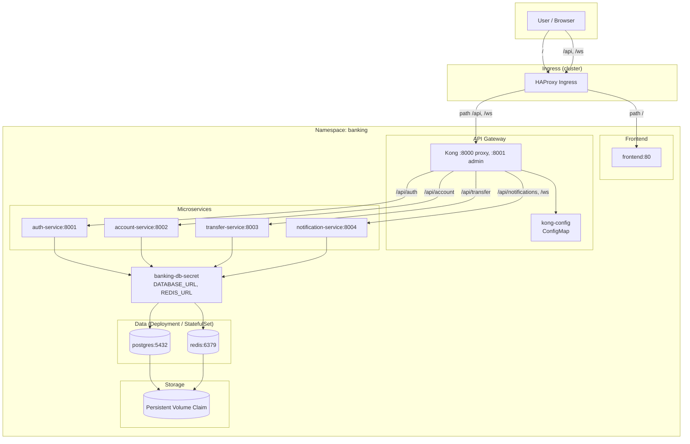

# Architecture

This document describes the traffic flow and components within the `banking` namespace.

---

## Overview Diagram

---

## Traffic Flow

| Source           | Ingress path | Backend           | Notes                            |
|------------------|-------------|-------------------|----------------------------------|
| User             | `/`         | **frontend:80**   | Web UI (React/SPA)               |
| User / Frontend  | `/api/*`    | **Kong:8000**     | Kong routes to microservices     |
| User / Frontend  | `/ws`       | **Kong:8000**     | WebSocket → notification-service |

**Kong routing (configured in ConfigMap `kong-config`):**

| Path / route         | Upstream service        | Port |
|----------------------|-------------------------|------|
| `/api/auth`          | auth-service            | 8001 |
| `/api/account`       | account-service         | 8002 |
| `/api/transfer`      | transfer-service        | 8003 |
| `/api/notifications` | notification-service    | 8004 |
| `/ws`                | notification-service    | 8004 |

---

## Kubernetes Components

| Component            | Type          | Notes |
|----------------------|---------------|--------|
| **postgres**         | Deployment    | 1 replica, Headless Service, PVC for storage |
| **redis**            | Deployment    | 1 replica, Headless Service, PVC for storage |
| **kong**             | Deployment    | 1 replica, reads config from `kong-config` ConfigMap |
| **auth-service**     | Deployment    | 1 replica, reads DB/Redis URL from Secret |
| **account-service**  | Deployment    | 1 replica |
| **transfer-service** | Deployment    | 1 replica |
| **notification-service**| Deployment | 1 replica |
| **frontend**         | Deployment    | 1 replica, serves static files on port 80 |
| **Ingress**          | Ingress       | `ingressClassName: haproxy`, path-based routing |

---

## Dependencies

- **Postgres, Redis** → Must be running before application services start (services read DATABASE_URL, REDIS_URL from Secret).
- **Kong** → Requires ConfigMap `kong-config`; all upstream services (auth, account, transfer, notification) must have Services in the same namespace.
- **Ingress** → Cluster must have HAProxy Ingress Controller installed via Helm; backend Services must exist.

---

## Storage

- **Postgres**: Uses a Persistent Volume Claim (`postgres-pvc`) mounted at `/var/lib/postgresql/data`.
- **Redis**: Uses a Persistent Volume Claim (`redis-pvc`) mounted at `/data`.
- In a local environment (like Minikube), standard host-path provisioner is used automatically.

This diagram can be rendered using Mermaid-supported tools (GitHub, GitLab, VS Code with Mermaid extension, or https://mermaid.live).
